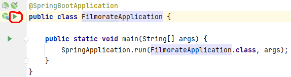
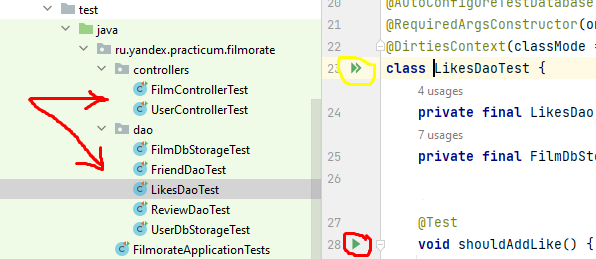
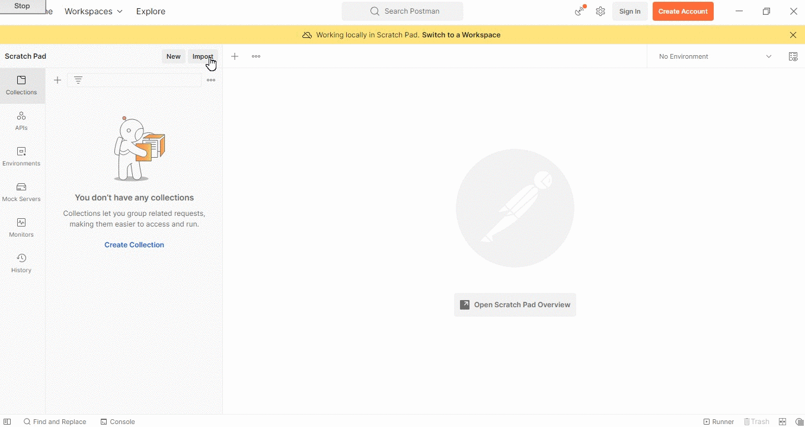

# Filmorate

#### (от англ. film — «фильм» и rate — «оценивать»)

### REST приложение для работы с фильмами и оценками пользователей

###### Приложение разработано в рамках прохождения учебного курса [Java-разработчик от Яндекс.Практикум](https://practicum.yandex.ru/java-developer/)

***

## Идея

Представьте, что после тяжёлого дня вы решили отдохнуть и провести вечер за просмотром фильма.
Вкусная еда уже готовится, любимый плед уютно свернулся на кресле — а вы всё ещё не выбрали, что
же посмотреть! Фильмов много — и с каждым годом становится всё больше. Чем их больше, тем больше
разных оценок. Чем больше оценок, тем сложнее сделать выбор. Однако не время сдаваться! Это 
приложение - бэкенд для сервиса, который работает с фильмами и оценками пользователей, а также
возвращает топ-10 фильмов, рекомендованных к просмотру. Теперь ни вам, ни вашим друзьям не
придётся долго размышлять, что посмотреть вечером.

## Основа приложения

Приложение представляет собой "монолит". Его основой являются классы, описывающие основные
объекты взаимодействия:

- пользователи
- фильмы
- жанры
- рейтинги возрастных ограничений
- режиссёры
- отзывы
- лента событий,
   а также классы для работы с ними.

## Функционал

Приложение при работе с:
1) **пользователями** позволяет:
   - добавлять пользователей (данные о новом пользователе передаются в теле запроса на эндпоинт `POST
     /users`)
   - обновлять пользователей (данные для обновления пользователя передаются в теле запроса на эндпоинт
     `PUT /users`)
   - удалять пользователей (идентификатор пользователя передаётся в переменную
     пути `DELETE /users/{id}`)
   - просматривать информацию о конкретном пользователе по идентификатору (идентификатор
     пользователя передаётся в переменную пути `GET /users/{id}`)
   - просматривать список всех пользователей (`GET /users`)
   - добавлять пользователя в друзья (идентификаторы пользователей передаются в переменные пути`PUT
     /users/{id}/friends/{friendId}`)
   - удалять пользователя из друзей (идентификаторы пользователей передаются в переменные пути
     `DELETE /users/{id}/friends/{friendId}`)
   - просматривать друзей другого пользователя (идентификатор пользователя передаётся в переменную
     пути `GET /users/{id}/friends`)
   - просматривать общих друзей с другим пользователем (идентификаторы пользователей передаются в
     переменные пути `GET /users/{id}/friends/common/{otherId}`)
2) **фильмами** позволяет:
   - добавлять фильмы (данные о новом фильме передаются в теле запроса на эндпоинт`POST /films`)
   - обновлять фильмы (данные для обновления пользователя передаются в теле запроса на эндпоинт
     `PUT films/`)
   - удалять фильмы (идентификатор фильма передаётся в переменную пути `DELETE /films/{id}`)
   - просматривать информацию о конкретном фильме по идентификатору (идентификатор фильма
     передаётся в переменную пути `GET /films/{id}`)
   - просматривать список всех фильмов (`GET /films`)
   - добавлять лайки к фильмам (идентификаторы фильма и пользователя, поставившего лайк, передаются
     в переменные пути на эндпоинт `PUT /films/{id}/like/{userId}`)
   - удалять лайки к фильмам (идентификаторы фильма и пользователя, поставившего лайк, передаются
     в переменные пути на эндпоинт `DELETE /films/{id}/like/{userId}`)
   - просматривать самые популярные фильмы (на основе лайков) (`GET /films/popular`, также реализована
     пагинация и можно передать параметрами запроса номер и размер страницы `?page=&count=`)
   - просматривать все фильмы определенного режиссера (идентификатор режиссёра передаётся в
     переменную пути `GET /films/directors/{directorId}`, также можно добавить параметр запроса 
     `?year=` для сортировки по году выхода фильма и реализована пагинация, позволяющая передать номер 
     и размер страницы `?page=&count=`)
   - просматривать общие с другим пользователем фильмы (идентификаторы пользователей передаются в
     параметры запроса `GET /films/common?userId=&friendId=`, также реализована пагинация и можно
     передать параметрами запроса номер и размер страницы `?page=&count=`)
   - просматривать рекомендации фильмов (идентификатор пользователя передаётся в переменную пути `GET
     /users/{id}/recommendations`, также реализована пагинация и можно передать параметрами запроса
     номер страницы и размер страницы `?page=&size=`)
   - искать фильмы по названию или режиссёру (в параметры запроса передаются название фильма и имя
       режиссёра `GET /films/search?query=&by=`)
3) **режиссёрами** позволяет:
   - добавлять режиссёров (данные о новом режиссёре передаются в теле запроса на эндпоинт `POST
     /directors`)
   - обновлять режиссёров (данные для обновления режиссёра передаются в теле запроса на эндпоинт
     `PUT /directors`)
   - удалять режиссёров (идентификатор режиссёра передаётся в переменную пути `DELETE /directors/{id}`)
   - просматривать данные о конкретном режиссёре по идентификатору (идентификатор режиссёра
     передаётся в переменную пути `GET /directors/{id}`)
   - просматривать список всех режиссёров (`GET /directors`)
4) **отзывами о фильмах** позволяет:
   - добавлять отзывы о фильмах (данные о новом отзыве передаются в теле запроса на эндпоинт `POST
     /reviews`)
   - обновлять отзывы о фильмах (данные для обновления отзыве передаются в теле запроса на эндпоинт
     `PUT /reviews`)
   - удалять отзывы о фильмах (идентификатор отзыва передаётся в переменную пути `DELETE
     /reviews/{id}`)
   - добавлять лайки к отзывам о фильмах (идентификаторы отзыва и пользователя, поставившего лайк,
     передаются в переменные пути на эндпоинт `PUT /reviews/{id}/like/{userId}`)
   - удалять лайки к отзывам о фильмах (идентификаторы отзыва и пользователя, удалившего лайк,
     передаются в переменные пути на эндпоинт `DELETE /reviews/{id}/like/{userId}`)
   - добавлять дизлайки к отзывам о фильмах (идентификаторы отзыва и пользователя, поставившего
     дизлайк, передаются в переменные пути на эндпоинт `PUT /reviews/{id}/dislike/{userId}`)
   - удалять дизлайки к отзывам о фильмах (идентификаторы отзыва и пользователя, удалившего дизлайк,
     передаются в переменные пути на эндпоинт `DELETE /reviews/{id}/dislike/{userId}`)
   - просматривать информацию о конкретном отзыве по идентификатору (идентификатор отзыва
     передаётся в переменную пути на эндпоинт `GET /reviews/{id}`)
   - просматривать все отзывы о конкретном фильме (идентификатор фильма передаётся параметром
     запроса на эндпоинт `GET /reviews/?filmId=`, дополнительно параметром запроса `?count=` можно
     указать количество фильмов на странице)
5) **лентой событий** позволяет:
   - просматривать ленту событий другого пользователя (идентификатор пользователя передаётся в
     переменную пути на эндпоинт`GET /users/{id}/feed`)
6) **жанрами фильмов** позволяет:
   - просматривать список всех жанров фильмов (`GET /genres`)
   - просматривать информацию о конкретном жанре фильмов по идентификатору (идентификатор жанра 
     передаётся в переменную пути на эндпоинт `GET /genres/{id}`)
7) **рейтингом возрастных ограничений фильмов** позволяет:
   - просматривать список всех рейтингов возрастных ограничений фильмов (`GET /mpa`)
   - просматривать информацию о конкретном рейтинге возрастных ограничений фильмов по идентификатору
     (идентификатор рейтинга возрастных ограничений передаётся в переменную пути на эндпоинт
     `GET /mpa/{id}`)

## Стек технологий

 - *[Windows](https://www.microsoft.com/ru-ru/software-download/windows10) 10* - операционная
система
 - *[Java](https://www.java.com/ru/) 11* - язык программирования
 - *[IntelliJ IDEA](https://www.jetbrains.com/ru-ru/idea/download/?ysclid=l8l4s0cdro888284513#section=windows)
2022.1.4 (Ultimate Edition)* - среда разработки
 - *[Spring Boot](https://spring.io/) 2.6.6* - используемый фреймворк
 - *[Apache Maven](https://maven.apache.org/) 4.0.0* - управление зависимостями
 - *[Project Lombok](https://projectlombok.org/) 1.18.24* - библиотека аннотаций для сокращения
шаблонного кода
 - *[JDBC](https://docs.spring.io/spring-framework/docs/current/javadoc-api/org/springframework/jdbc/core/JdbcTemplate.html)* - 
компонент Spring `JdbcTemplate`
 - *[H2](https://ru.wikipedia.org/wiki/H2)* - база данных
 - *[Postman](https://www.postman.com/downloads/) 9.31.0* - приложение для выполнения запросов
к API.

## Запуск приложения

На Вашем компьютере должны быть установлены соответствующие приложения из раздела ["Стек
технологий"](#стек-технологий).
 Для запуска приложения необходимо:

- склонировать [проект](https://github.com/gorden73/Filmorate) на свой компьютер
- открыть склонированный проект
  в *[IntelliJ IDEA](https://www.jetbrains.com/ru-ru/idea/download/?ysclid=l8l4s0cdro888284513#section=windows)*
- запустить выполнение главного метода программы `Main` класса `FilmorateApplication`, нажав на
  зелёный треугольник в верхней панели,
   
   либо слева от названия главного класса
   
   После компиляции и запуска приложения им можно пользоваться.
   Для этого можно использовать браузер или программу для работы с API,
  например, [Postman](https://www.postman.com/).
   В адресной строке написать `https://localhost:8080/` и далее необходимый эндпоинт для
  подходящего действия из раздела [Функционал](#функционал).

## Выполнение тестов

Написаны модульные тесты и есть тестирование с помощью коллекции тестов и приложения
[Postman](https://www.postman.com/downloads/), способного выполнять запросы к API.
 Чтобы выполнить модульные тесты достаточно открыть склонированный проект
в *[IntelliJ IDEA](https://www.jetbrains.com/ru-ru/idea/download/?ysclid=l8l4s0cdro888284513#section=windows)*
, перейти в директорию тестов `Filmorate/src/test/java/ru.yandex.practicum.filmorate` и выбрать из
предложенных интересующий класс для проверки (красная стрелка).
 
 Внутри класса можно запустить выполнение определенного теста, нажав на зелёный треугольник слева
от названия теста (красный кружок) или же запустить все тесты, которые есть в данном
классе (жёлтый кружок).
 Для запуска коллекции тестов необходимо предварительно выполнить все инструкции из раздела
["Запуск приложения"](#запуск-приложения), далее запустить приложение
[Postman](https://www.postman.com/downloads/), импортировать
[коллекцию тестов](/postman/tests-collection.json), нажать на вкладку *"Run collection"*.
 
 Готово. Тесты пройдут автоматически.

## Автор

Связаться с автором проекта можно в [telegram](https://web.telegram.org/) (@gorden73).

[Вернуться в начало](#filmorate)
